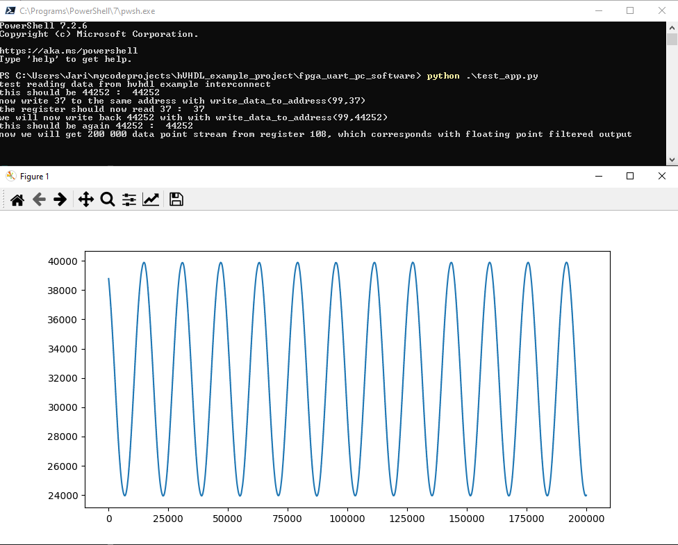

This is a test project that uses the main features of [hVHDL](https://github.com/hVHDL) libraries. The test project creates a noisy sine wave that is then filtered using fixed and floating point filters that are written in using hVHDL modules. There is an [explanation](https://hvhdl.readthedocs.io/en/latest/hvhdl_example_project/hvhdl_example_project.html). The test application can be run using the python script in the pc_application. Doing this gets the following result.

  </a>

The example project has been built with Lattice Diamond, Xilinx Vivado, Intel Quartus and Efinix Efinity and tested with lattice ECP5 and Spartan 7 FPGAs. The build scripts can be found in the repository.

Note, tested to NOT work with 3.11 version of Lattice Diamond on a Windoew 11. Either Version of 3.12 works.

Lattice Diamond build can be launched using
> pnmainc <path_to_example_project>/ecp5_build/build_ecp5.tcl

Vivado build can be launched using
> vivado -mode tcl -notrace -source <path_to_example_project>/spartan7_build/vivado_compile.tcl

Quartus build can be launched using
> quartus_sh -t <path_to_example_project>/quartus_build/compile_with_quartus.tcl

In order to build with efinix, go to the efinix build folder <path_to_example_project>/efinix_build, then run
> efx_run.py hvhdl_example_build.xml --output_dir ./output

Note, efinix build tools require the use of cmd if using windows and running <efinix_efinity_folder>\bin\setup.bat. Alternatively, you can open the hvhdl_exmpla_build.xml with the efinity ide and just press build
