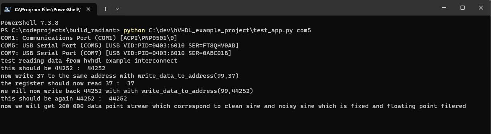
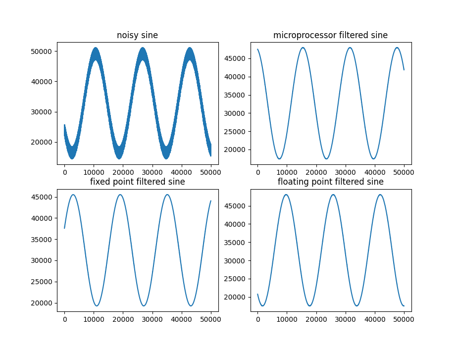

To clone with all submodules use

git clone --recurse-submodules -j8 https://github.com/hVHDL/hVHDL_example_project.git

This is a test project that uses the main features of [hVHDL](https://github.com/hVHDL) libraries. The test project creates a noisy sine wave that is then filtered using fixed and floating point filters that are written using hVHDL modules. Running 

>python test_app.py com7 

test reading and writing in the FPGA and prints out the results to the console and additionally requests a 200 000 data point stream from the FPGA that is then plotted using pyplot.

  </a>

  </a>

There is an in-depth [explanation](https://hvhdl.readthedocs.io/en/latest/hvhdl_example_project/hvhdl_example_project.html) which goes through the VHDL source code of the design.

  </a>

The example project has been built with Lattice Diamond and Radiant, Xilinx Vivado, Intel Quartus and Efinix Efinity. The build scripts can be found in the repository.

Note, tested to NOT work with 3.11 version of Lattice Diamond on a Windows 11. Either Version of 3.12 and 3.13 has been tested to work.

Lattice Diamond build can be launched using
> pnmainc <path_to_example_project>/ecp5_build/build_ecp5.tcl

Quartus build can be launched using
> quartus_sh -t <path_to_example_project>/quartus_build/compile_with_quartus.tcl

In order to build with efinix, go to the efinix build folder <path_to_example_project>/efinix_build, then run
> efx_run.bat hvhdl_example_build.xml --output_dir ./output

Vivado build can be launched using
> vivado -mode tcl -notrace -source <path_to_example_project>/alchitry_au_plus/vivado_compile.tcl

Lattice Radiant build can be launched using
> pnmainc <path_to_example_project>/radiant_build/radiant_compile.tcl

Note, efinix build tools require running <efinix_efinity_folder>\bin\setup.bat before launching the build. Alternatively, you can open the hvhdl_exmpla_build.xml with the efinity ide and press build
